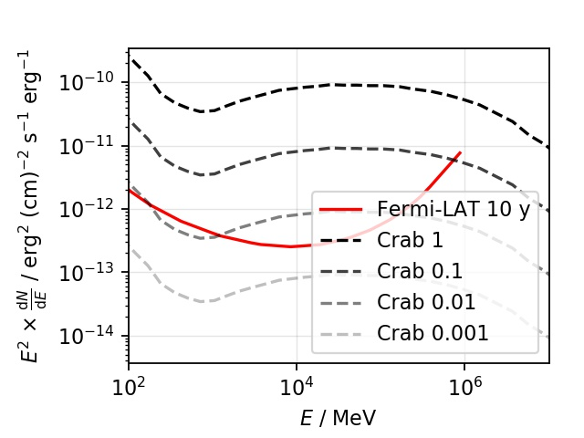
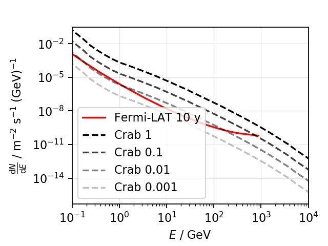
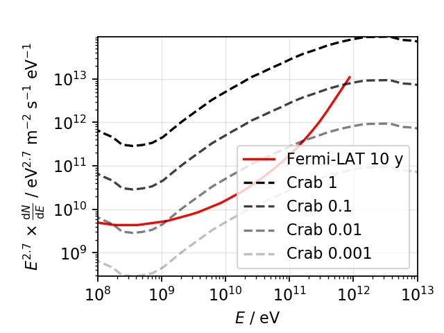
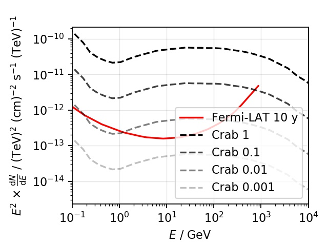

# Converting Spectral-Energy-Distributions SEDs

# Problem
The same SED can have different styles and units what can be challenging to compare. See example styles A, B, C, and D:
| A | B |
| - | - |
|  |  |

```python
A = {
    "x_energy_in_eV": 1e6,
    "y_inverse_energy_in_eV": 624150907446.0763,
    "y_inverse_area_in_m2": 1e-4,
    "y_inverse_time_in_s": 1.0,
    "y_scale_energy_in_eV": 624150907446.0763,
    "y_scale_energy_power": 2.0,
}

B = {
    "x_energy_in_eV": 1e9,
    "y_inverse_energy_in_eV": 1e9,
    "y_inverse_area_in_m2": 1.0,
    "y_inverse_time_in_s": 1.0,
    "y_scale_energy_in_eV": 1e9,
    "y_scale_energy_power": 0.0,
}
```

| C | D |
| - | - |
|  |  |

```python
C = {
    "x_energy_in_eV": 1,
    "y_inverse_energy_in_eV": 1,
    "y_inverse_area_in_m2": 1,
    "y_inverse_time_in_s": 1.0,
    "y_scale_energy_in_eV": 1,
    "y_scale_energy_power": 2.7,
}

D = {
    "x_energy_in_eV": 1e9,
    "y_inverse_energy_in_eV": 1e12,
    "y_inverse_area_in_m2": 1e-4,
    "y_inverse_time_in_s": 1.0,
    "y_scale_energy_in_eV": 1e12,
    "y_scale_energy_power": 2.0,
}
```
# Solution
This function converts between the styles:
```python
import spectral_energy_distribution_units as sed

x_B, y_B = sed.convert_units_with_style(x=x_A, y=y_A, input_style=A, target_style=B)
```
There is also the explicit call with the dictionaries unpacked:
```python

x_B, y_B = sed.convert_units(x=x_A, y=y_A, ... )
```
Thats all. It does only transforms the styles of the numeric ```x```-axis, and ```y```-axis.

## Install
```
pip install ./spectral_energy_distribution_units
```

## Example usage
See unit-tests
```./spectral_energy_distribution_units/tests/test_convert.py```
to reproduce the upper figures A, B, C, and D.

